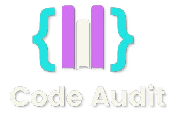

## Table of Contents
- [Table of Contents](#table-of-contents)
- [Introduction](#introduction)
- [Features](#features)
- [Technologies Used](#technologies-used)
- [Installation](#installation)
- [Usage](#usage)

## Introduction
**CodeAudit** is a hackathon project developed by a team of four members. It is a web application designed to help developers improve their code by providing suggestions on optimization, naming standards, and code quality. The tool supports multiple programming languages and uses the latest AI models to generate insightful feedback.

## Features
- **Multi-language Support:** Works with JavaScript, Python, Java, C#, C++, Go, Ruby, and TypeScript.
- **Inline Comments:** Provides inline comments to highlight areas of improvement.
- **Code Editor:** Integrated Monaco Editor with a custom black theme for an enhanced coding experience.
- **AI-Powered Feedback:** Utilizes AI to analyze and suggest improvements for your code.

## Technologies Used
- **Frontend:**
  - React
  - Chakra UI
  - Monaco Editor
- **Backend:**
  - Node.js
  - Express
  - Axios
- **AI:**
  - Google Gemini API

## Installation
Follow these steps to set up the project locally:

1. Clone the repository:
    ```bash
    git clone https://github.com/your-username/codeaudit.git
    cd codeaudit
    ```

2. Install dependencies:
    ```bash
    npm install
    ```

3. Start the development server:
    ```bash
    npm start
    ```

4. Open your browser and navigate to `http://localhost:3000`.

## Usage
1. Enter your code in the integrated editor.
2. Select the programming language from the dropdown.
3. Type your question or specific aspect of the code you want
